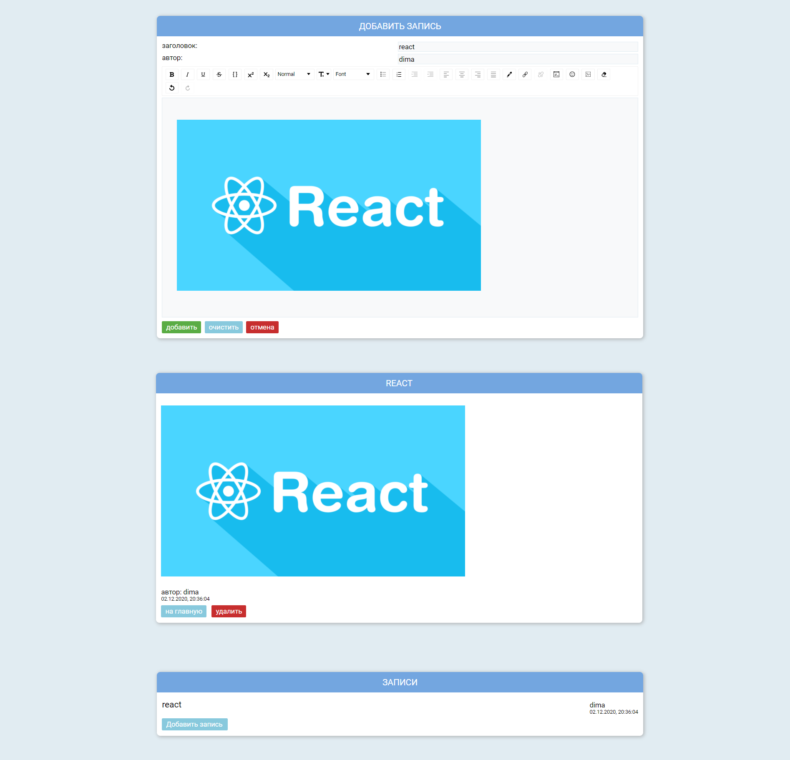

# blog-react
# 
## Getting started
To get the frontend running locally:
- Clone this repo
- `npm/yarn install` to install all req'd dependencies
- `npm/yarn start` to start the local server (this project uses create-react-app)
## Technologies used
- React
- Redux
- React Router
- SCSS
